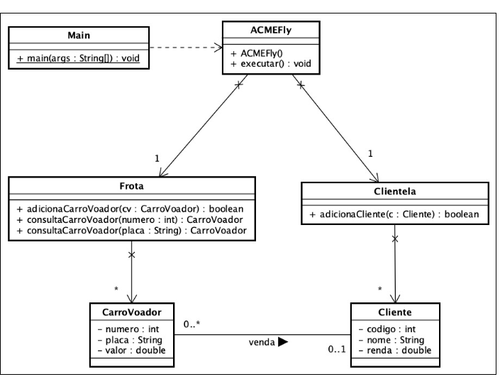

**Pontifícia Universidade Católica do Rio Grande do Sul** 

**Programação Orientada a Objetos Prof. Marcelo H. Yamaguti** 

**2025/1** 
**

**Exercício de Avaliação 1** 
**

**

1. **Enunciado geral:** 

A ACMEFly é uma empresa que produz e vende carros voadores para clientes. 

Você será responsável pelo desenvolvimento de um aplicativo que gerenciará o cadastramento e vendas de carros voadores a clientes. 

O analista de sistemas identificou as seguintes classes iniciais, com alguns atributos e relacionamentos apresentados a seguir. 

O analista identificou operações básicas iniciais das classes: 

- **CarroVoador**: classe que representa um carro voador para venda. 
- **Frota**: classe catálogo que gerencia o cadastro de carros voadores: 
  - **adicionaCarroVoador(CarroVoador)**: recebe como parâmetro um novo carro voador e o cadastra no sistema. Não pode haver carros voadores com número, nem placa repetidos. Retorna *true* se o cadastro teve sucesso; ou false em caso contrário. 
  - **consultaCarroVoador(int)**: retorna o carro voador com o número indicado. Se não houver nenhum carro voador com este número retorna *null*. o **consultaCarroVoador(String)**: retorna o carro voador com a placa indicada. Se não houver nenhum carro voador com esta placa retorna *null*. 
- **Cliente**: classe que representa um cliente que pode comprar carros voadores. 
- **Clientela**: classe catálogo que gerencia o cadastro de clientes: 

o **adicionaCliente(Cliente)**: recebe como parâmetro um novo cliente e o cadastra no sistema. Não pode haver clientes com código repetido. Retorna *true* se o cadastro teve sucesso; ou *false* em caso contrário. 

• **ACMEFly**: classe da aplicação: 

- **ACMEFly()**: construtor da aplicação. 
- **executar()**: executa o funcionamento da aplicação. 

• **Main**: classe principal (inicial) do sistema: 

o **main(String[])**: cria um objeto ACMEFly e depois chama o método executar().  

O método executar() da classe ACMEFly deve realizar a sequência de passos: 

1. **Cadastrar carros voadores**: lê todos os dados de cada carro voador e, se nem o número, nem a placa forem repetidos, cadastra-o no sistema. Se o número ou placa for repetido, mostra a mensagem de erro: “**1:erro-carro repetido.**”. Para cada carro voador cadastrado com sucesso no sistema, mostra os dados do carro voador no formato: **1:número:placa:valor** 
1. **Cadastrar clientes**: lê todos os dados de cada cliente e, se o código não for repetido, cadastra o cliente no sistema. Se o código for repetido, mostra a mensagem de erro: “**2:erro-cliente repetido.**”. Para cada cliente cadastrado com sucesso no sistema, mostra os dados do cliente no formato: **2:código:nome:renda** 
1. **Mostrar os dados do carro mais barato**: localiza o carro cadastrado mais barato e mostra os seus dados. Se não existir carros cadastrados, mostra a mensagem de erro: “**3:nenhum carro encontrado.**”. Se existir, mostra os dados do carro mais barato no formato: **3:número:placa:valor** 
1. **Mostrar os dados do cliente com maior renda**: localiza o cliente cadastrado com maior renda e mostra os seus dados. Se não existir clientes cadastrados, mostra a 

   mensagem de erro: “**4:nenhum cliente encontrado.**”. Se existir, mostra os dados do cliente maior renda no formato: **4:código:nome:renda** 

1. **Vender carros voadores**: lê o código de um cliente e o número de um carro e registra uma venda. Se não existir cliente com o código lido, mostra  a mensagem de erro: “**5:erro-cliente inexistente.**”. Se não existir carro voador com o número lido, mostra a mensagem de erro: “**5:erro-carro inexistente.**”. Se existir um carro voador com o número lido, mas este carro voador já possuir cliente, mostra a mensagem de erro: “**5:erro-carro possui cliente.**”.  Para cada venda com sucesso mostra os dados no formato: **5:nome:placa** 
1. **Mostrar os dados do cliente com mais carros voadores**: localiza o cliente com maior quantidade de carros voadores comprados. Se não houver cliente com carros 

   comprados, mostra a mensagem de erro: “**6:erro-nenhum cliente** 

   **encontrado.**”. Caso contrário, mostra o nome do cliente e a quantidade de carros correspondente no formato: **6:nome:quantidade** 

1. **Mostrar os dados de um determinado carro voador**: lê a placa de um carro voador. Se não existir um carro voador com a placa lida, mostra a mensagem de erro: “**7:erro-carro inexistente.**”. Se o carro voador existir mas não tiver cliente, mostra a mensagem de erro: “7:**erro-carro sem cliente.**”. Se o carro voador existir e houver cliente, mostra os dados no formato: **7:placa:nome** 

1. **Definição do exercício:**  

O objetivo do exercício é implementar um sistema que capaz de atender as necessidades da empresa descrita no enunciado geral, e que atenda as restrições a seguir: 

- A entrada de dados ocorrerá por leitura de arquivo de texto. Ajuste a classe ACMEFly para ler e escrever em arquivos: veja na área Moodle da disciplina > Módulo: Materiais de apoio > CÓDIGOS AUXILIARES > Redirecionamento de entrada/saída de dados para arquivos. 
- Os dados de entrada deverão ser lidos do arquivo **‘dadosentrada.txt’** e a saída deverá ser gravada no arquivo **‘dadossaida.txt’** o No passo **1. Cadastrar carros voadores**: cada linha corresponde número, placa e valor de um carro voador. Quando o número lido for -1, não há mais carros voadores a serem cadastrados. o No passo **2. Cadastrar cliente**: cada linha corresponde ao código, nome e renda de um cliente. Quando o número lido for -1, não há mais clientes a serem cadastrados. o No passo **3. Vender carros voadores**: cada linha corresponde ao número de um cliente e o código de um carro voador correspondente. Quando o número lido for -1, não há mais vendas a serem cadastradas. 

o A última linha do arquivo de entrada corresponde a placa do carro voador do passo 

7\. 

- Toda entrada e saída de dados deve ocorrer apenas na classe ACMEFly. 
- É permitida a criação de novos métodos, atributos, classes e relacionamentos, mas as informações definidas no diagrama de classes original não podem ser alteradas. 
- O diagrama de classes deve ser atualizado conforme as alterações realizadas e deve ser entregue em arquivo Astah ou PDF. 
**

1. **Critérios de avaliação** 

O exercício será avaliado conforme os seguintes critérios: 

- Diagrama de classes atualizado e coerente com a solução: 1 ponto. 
- Implementação correta conforme especificação e diagrama de classes: 4 pontos. 
- Execução correta dos passos solicitados: 5 pontos. 

o Haverá comparação do arquivo gerado pela sua solução com os arquivos-teste disponíveis no Moodle (comando diff no Linux ou comp no Windows) 

• *Ponto extra (opcional) de 1 ponto (máximo de 10 pontos): implementação e execução correta do passo indicado:* o *Mostrar o carro e cliente correspondente mais próximo da média:* apenas para os carros que têm cliente: 

- Calcula a média aritmética dos valores dos carros que têm cliente; 
- Localiza o carro que tem cliente e cujo valor é mais próximo da média aritmética calculada; 
- Se não houver carros com cliente mostra a mensagem de erro: “8**:errocarro inexistente.**” 
- Se houver, mostra os dados do carro localizado e cliente correspondente no formato: **8:número:placa:valor:código:nome:renda** 

1. **Entrega:**  

• A entrega do exercício envolverá: 

- arquivos dos números-fonte do sistema (e demais arquivos necessários para a compilação do sistema). 
- arquivo com o diagrama de classes atualizado. 
- Deverá ser gerado um arquivo compactado (.zip ou .rar), com os itens acima, e entregue na tarefa da área Moodle da disciplina. 
- **Data de entrega: 9 / 4 / 2025.** 
**

1. **Considerações finais:**  
   1. O exercício deve ser desenvolvido **individualmente**. 
   1. A implementação deve seguir o Java Code Conventions para nomes de identificadores e estruturas das classes. 
   1. Não será aceito exercício com erros de compilação. Programas que não compilarem corretamente terão nota zerada. 
   1. A cópia parcial ou completa do exercício terá como consequência a atribuição de nota 0 (zero) aos exercícios dos alunos envolvidos. Para análise de similaridade será utilizado o MOSS (<https://theory.stanford.edu/~aiken/moss/>[)](https://theory.stanford.edu/~aiken/moss/). 

